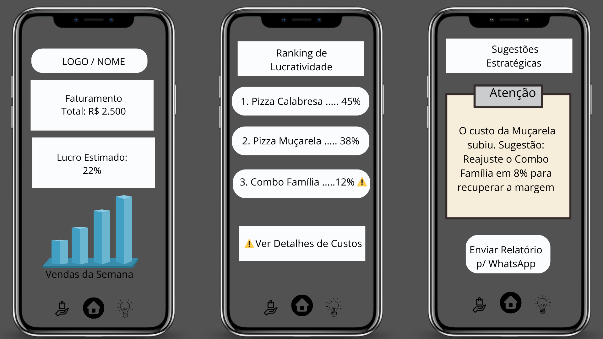
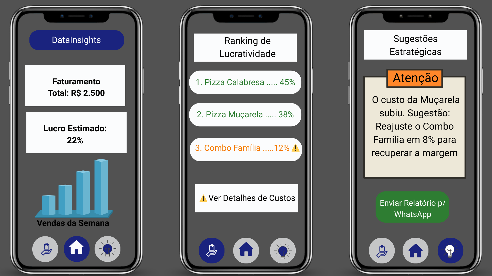
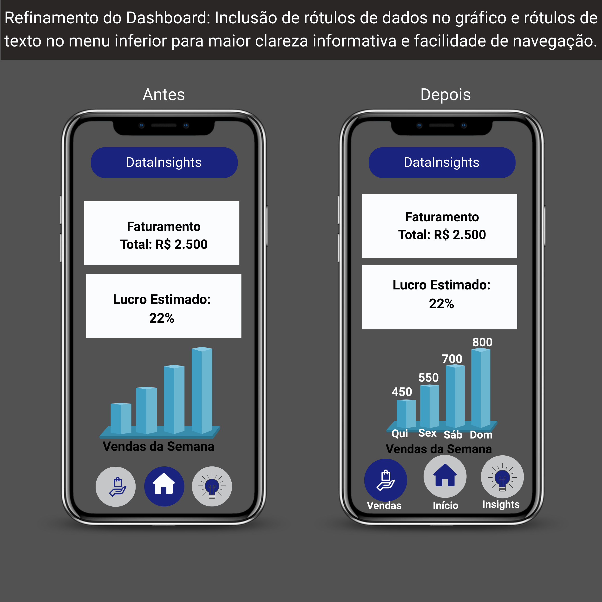
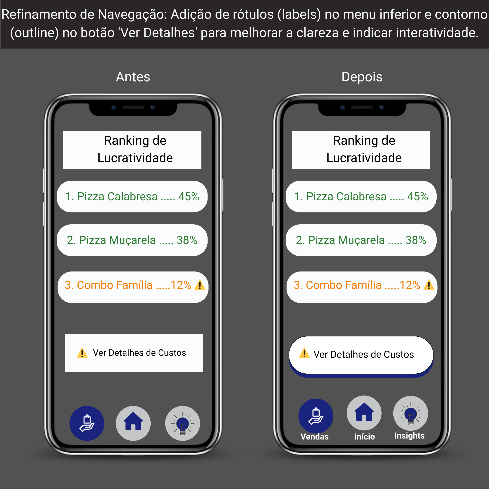

# DataInsights: Transformando Dados em Decisões Estratégicas 📊

Estudo de Caso de UX/UI desenvolvido para a disciplina de **Interface e Jornada do Usuário (ADS)**. O foco deste projeto foi criar um dashboard mobile para auxiliar pequenos empreendedores na gestão de faturamento e lucro.

## 👤 Persona
**Letícia Mendes**, proprietária de uma pequena loja. Precisa de agilidade, clareza nos números e uma ferramenta que minimize erros de interpretação durante um dia a dia agitado.

## 🚀 Evolução do Projeto

### 1. O Início: Wireframe (Baixa Fidelidade)
A estrutura inicial foi planejada para garantir uma navegação fluida entre os três pilares: Dashboard, Ranking de Produtos e Insights.

> 

### 2. Design e Acessibilidade (Média Fidelidade)
O design foi refinado com foco em:
* **Acessibilidade:** Uso do **triângulo de alerta** para identificar falhas financeiras, garantindo que usuários daltônicos compreendam os dados sem depender apenas das cores verde/vermelho.
* **Hierarquia:** KPIs (Faturamento/Lucro) posicionados no topo para leitura rápida.

> 

### 3. Teste de Usabilidade e Refinamento (Comparativo)
Após testes moderados, identifiquei que o minimalismo excessivo gerava dúvida. Apliquei melhorias cruciais, focadas em clareza de dados e navegação:

> 
> 

---

## 📄 Documentação Completa
Para ler o estudo de caso detalhado com todas as análises, testes e reflexões críticas, acesse o link abaixo:

👉 [**Baixar Estudo de Caso Completo (PDF)**](./documentacao-datainsights.pdf)

---
**Desenvolvido por Fabio Santos**
